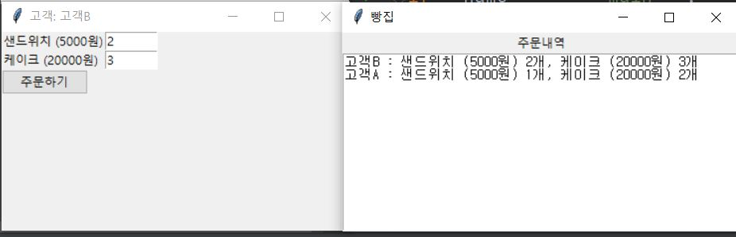
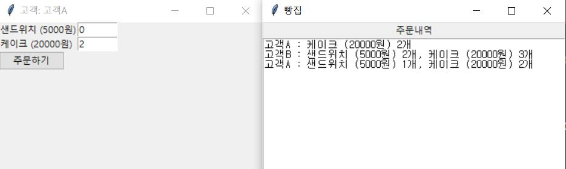
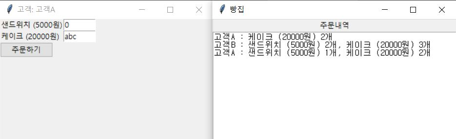

# python_gui_bakery
implement a bakery program with python gui.

# When I enter RIGHT SANDWICH and RIGHT CAKE
customer A

custormer B

# When I enter WRONG SANDWICH and RIGHT CAKE
customer A

customer A

# When I enter WRONG SANDWICH and WRONG CAKE

